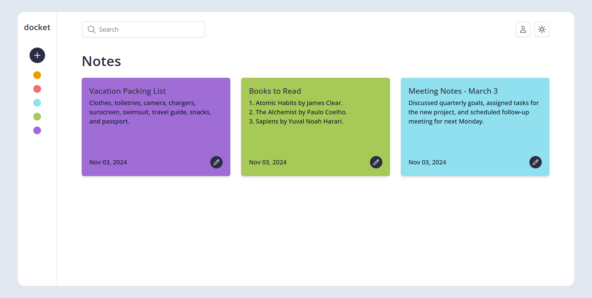
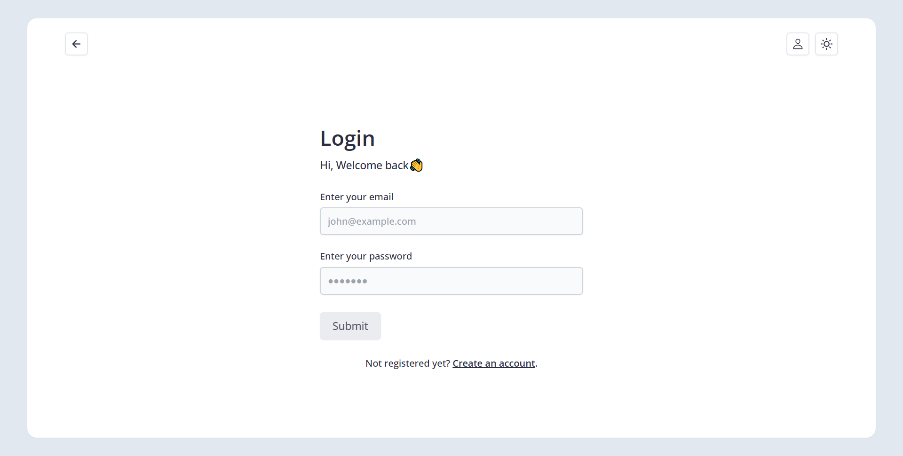

# Docket | Notes Management Application

Docket is a responsive and user-friendly notes management application that allows users to create, read, update, and delete notes securely. The application features both a **frontend** built with **React.js**, **Redux**, and **TailwindCSS**, and a **backend** powered by **Node.js**, **Express.js**, and **MongoDB**.

## Table of Contents

- [Docket](#docket---notes-management-application)
  - [Table of Contents](#table-of-contents)
  - [Features](#features)
    - [Frontend](#frontend)
    - [Backend](#backend)
  - [Technologies Used](#technologies-used)
    - [Frontend](#frontend-1)
    - [Backend](#backend-1)
  - [Frontend Screenshots](#frontend-screenshots)
  - [Backend API Endpoints](#backend-api-endpoints)
    - [Authentication](#authentication)
    - [Users](#users)
    - [Notes](#notes)
  - [Project Links](#project-links)

## Features

### Frontend

- **User Authentication**: Secure sign-up, login, and logout functionalities with session handling.
- **Responsive Design**: Optimized for both desktop and mobile devices.
- **Create Notes**: Add notes with a title and content, stored securely in the backend.
- **Read Notes**: View a list of all notes and read individual notes.
- **Update Notes**: Edit titles and content with instant feedback.
- **Delete Notes**: Remove notes from your account with confirmation to prevent accidental deletion.

### Backend

- **User Authentication**: JWT-based secure sign-up, login, and logout with token refresh.
- **Create Notes**: Allows users to add new notes securely stored in MongoDB.
- **Read Notes**: Retrieve all notes or specific notes by ID.
- **Update Notes**: Edit titles and content of existing notes.
- **Delete Notes**: Remove notes from the database with confirmation.

## Technologies Used

### Frontend

- **[React.js](https://reactjs.org/)**: A JavaScript library for building dynamic user interfaces.
- **[TailwindCSS](https://tailwindcss.com/)**: A utility-first CSS framework for custom styling.
- **[Redux](https://redux.js.org/)**: Global state management for consistent data flow.
- **[React Router DOM](https://reactrouter.com/)**: Routing for enhanced navigation.

### Backend

- **[Node.js](https://nodejs.org/)**: JavaScript runtime for server-side code.
- **[Express.js](https://expressjs.com/)**: Web framework for API routing and HTTP requests.
- **[MongoDB](https://www.mongodb.com/)**: NoSQL database for flexible data storage.
- **[Mongoose](https://mongoosejs.com/)**: ODM for schema-based MongoDB interaction.
- **[JWT (JSON Web Tokens)](https://jwt.io/)**: Secure token-based authentication.

## Frontend Screenshots

  
_Dashboard showing a list of notes with options to view & edit notes_

  
_Login screen with a simple form_

## Backend API Endpoints

### Authentication

- **`POST /auth/register`**: Register a new user.
- **`POST /auth/login`**: Log in an existing user.
- **`POST /auth/logout`**: Log out the current user.
- **`POST /auth/refresh`**: Refresh the JWT token.

### Users

- **`POST /auth/delete-user`**: Delete the current user account.

### Notes

- **`GET /notes`**: Retrieve all notes.
- **`GET /notes/:id`**: Retrieve a specific note by ID.
- **`POST /notes`**: Create a new note.
- **`PUT /notes/:id`**: Update an existing note by ID.
- **`DELETE /notes/:id`**: Delete a specific note by ID.

## Project Links

- **Frontend Code**: [Frontend Repository]()
- **Live Frontend**: [Docket Live]()
- **Backend Code**: [Backend Repository]()
- **Live API**: [Docket API]()
